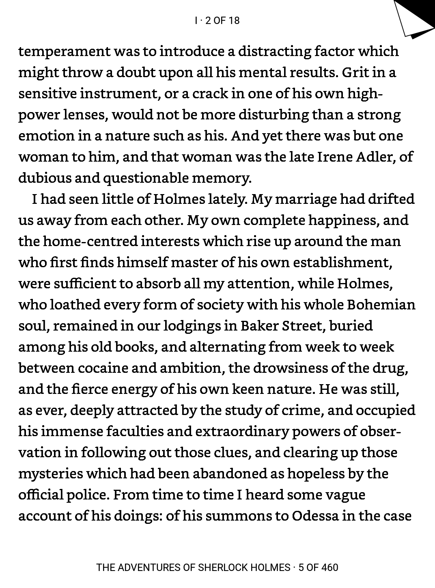
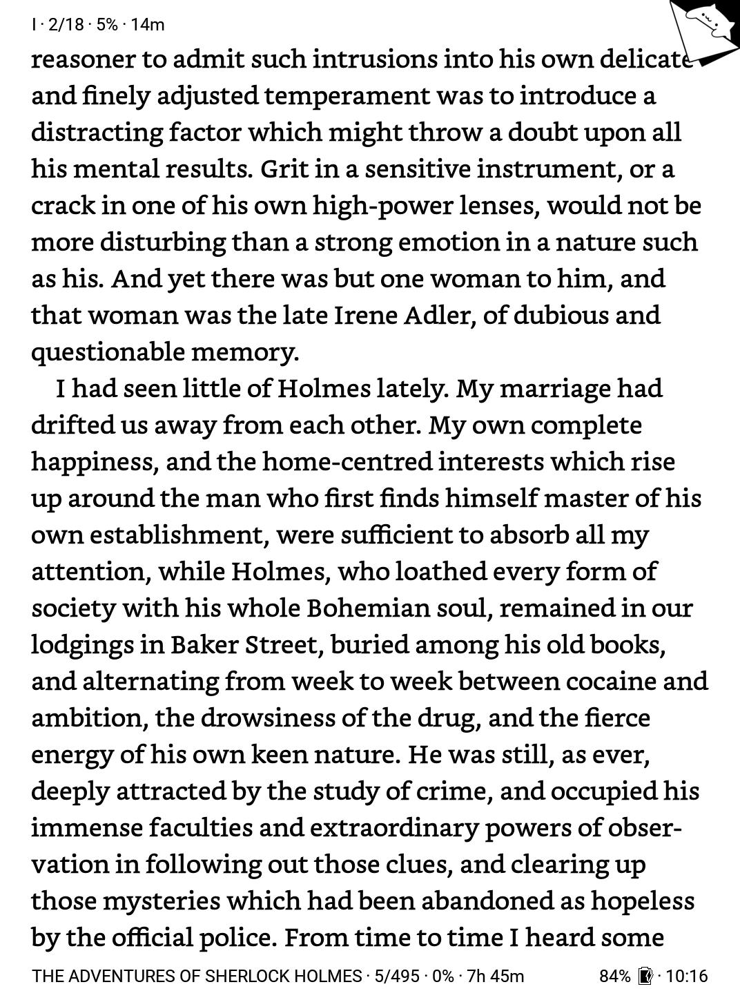
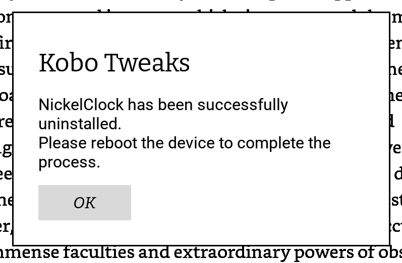

## original project by redphx, this repo is a fix for the issue described [here](https://github.com/shermp/NickelClock/pull/28) :)

---

# Kobo Tweaks

A beginner-friendly addon for customizing Kobo eReaders.

## 🔥 1. Features
- Customize various UI elements and features of Kobo eReaders (similar to [KoboPatch](https://github.com/pgaskin/kobopatch), can be used with patched firmware)
  - Reduces header and footer's heights  
- Widgets for Reading view:
  - Battery and Clock widgets (similar to [NickelClock](https://github.com/shermp/NickelClock))
  - Book widgets: title, progress, pages, remaining time
  - Chapter widgets: title, progress, pages, remaining time
- Customize bookmark image
- More to come...

#### Difference from KoboPatch:
  - Beginner-friendly, "patches" can be customized without reinstalling firmware (just edit and reboot)
  - No need to wait for patch updates when a new firmware is released (most of the time)
  - Downside: not all patches can be implemented, and it requires more work to add a new tweak

#### Difference from NickekClock:  
  - Uses its own widgets for clock & battery instead of Kobo's built-in ones (reduce the likelihood of encountering unwanted bugs)
  - Clock & battery only update after a page turn
  - Supports Dark mode
  - Downside: it conflicts with **NickelClock**. You can [uninstall NickelClock](https://github.com/shermp/NickelClock#uninstall-nickelclock) manually, or let **Kobo Tweaks** handle the uninstallation automatically.

<table align="center">
  <thead>
    <tr>
      <td align="center" colspan="2"><b>Before/After</b></td>
    </tr>
  </thead>
  <tbody>
    <tr>
      <td align="center" colspan="2">
        
      </td>
    </tr>
    <tr>
      <td valign="top">
        <b>Changes:</b><br><br>
        <ul>
          <li>Reduced header and footer's heights</li>
          <li>Clock, Battery, Book and Chapter widgets</li>
          <li>Custom bookmark image</li>
        </ul>
      </td>
      <td>
        <b>Settings used:</b><br><br>
        <pre lang="INI">[Reading]
BookmarkImage=bongo-cat.png
FooterSpacerHeight=10
HeaderFooterHeightScale=50
HeaderFooterMargins=46
HeaderSpacerHeight=10
&nbsp;
[Reading.Widget]
FooterCenter=
FooterLeft=BookTitle, BookPage, BookProgress, BookTime
FooterRight=Battery, Clock
HeaderCenter=
HeaderLeft=ChapterTitle, ChapterPage, ChapterProgress, ChapterTime
HeaderRight=
Separator=Dot
Spacing=5
&nbsp;
[Reading.Widget.Battery]
ShowWhenBelow=20
Style=Icon
StyleCharging=LevelIcon
&nbsp;
[Reading.Widget.Clock]
24hFormat=true
</pre>
      </td>
    </tr>
  </tbody>
</table>

## 🛠️ 2. Installation

**Kobo Tweaks** should be compatible with any Kobo eReader running a recent 4.x firmware.

Follow these steps to install **Kobo Tweaks**:  
  1. Connect your Kobo eReader to your computer
  2. Download the latest [KoboRoot.tgz](https://github.com/redphx/kobo-tweaks/releases/latest) file and place it inside the hidden `.kobo` folder on your Kobo eReader
  <pre>.kobo/
├─ KoboRoot.tgz</pre>
  > - The file name must be `KoboRoot.tgz` (don't unzip it)
  > - If you're using macOS and don't see the `.kobo` folder in Finder, press the combination `Cmd + Shift + .`
  3. Eject the device safely to avoid data corruption

After it installs and reboots, open a book and you'll see new Clock and Battery widgets on the header. To customize **Kobo Tweaks**, check the **Customization** section below.

> [!IMPORTANT]
> <table align="center"><tr><td align="center"></td></tr><tr><td>Since <b>Kobo Tweaks</b> cannot be used with <b>NickelClock</b>, it automatically detects and uninstalls <b>NickelClock</b> for you.<br><br>If this dialog appears when opening a book and the layout is broken, restart the device once again before continuing. If it doesn't work, try to <a href="https://github.com/shermp/NickelClock#uninstall-nickelclock">uninstall NickelClock</a> manually.</td></tr></table>

There are a few new files and folders in your Kobo eRreader:
<pre>.adds/
├─ tweaks/
│  ├─ images/
│  ├─ DELETE_TO_UNINSTALL.txt
│  ├─ settings.ini</pre>

> [!IMPORTANT]
> If these files appear in your library, see the **Troubleshooting section** for the fix.

### 🗑️ Uninstallation
To uninstall **Kobo Tweaks**, delete the `DELETE_TO_UNINSTALL.txt` file and restart the device. The file also contains the currently installed **Kobo Tweaks** version. Please include that information when reporting a bug.

## 💃 3. Customization

> [!WARNING]
> After installation, the `Reading settings > Reading progress > Header/Footer` values will always be `Off`. You can only use widgets provided by Kobo Tweaks.

Settings can be customized by editing the `.adds/tweaks/settings.ini` file on your Kobo eReader.

### [Reading]
> Applies after reopening the book

| Setting and description | Values |
|-|-|
| `BookmarkImage`<br>---<br><i>Custom bookmark image file name, including extension, located in the `.adds/tweaks/images`</i>| String |
| `HeaderFooterHeightScale`<br>---<br><i>Percentage-based scaling factor applied to the original header and footer height.<br>For example, a value of `66` means the header and footer are rendered at `66 percent` of their original height.</i> | <b>Unit:</b> %<br><b>Range:</b> 50-100<br><b>Default:</b> 100 |
| `HeaderFooterMargins`<br>---<br><i>Sets the left and right margins for both header and footer</i> | <b>Range:</b> 0-100<br><b>Default:</b> 50 |
| `HeaderSpacerHeight`, `FooterSpacerHeight`<br>---<br><i>Sets the amount of space between header/footer and the text</i> | <b>Range:</b> 0-100<br><b>Default:</b> 0 |

### [Reading.Widget]
> Applies after reopening the book

| Setting and description | Values (case-insensitive) |
|-|-|
| `HeaderLeft`, `HeaderCenter`, `HeaderRight`<br>`FooterLeft`, `FooterCenter`, `FooterRight`<br>---<br><i>Defines the widget position and type</i> | - Check the list of supported widgets below<br>- Multiple widgets can be placed in one slot<br>- Each widget can only be used once |
| `Separator`<br>---<br><i>Symbol between widgets</i> | `Bullet` •<br>`Dot` ·<br>`Pipe` \|<br>or blank |
| `Spacing`<br>---<br><i>Space between widgets</i> | <b>Range:</b> 0-20<br><b>Default:</b> 10 |

- All widgets support Dark mode
- Supported widgets:
  - `Battery`
  - `Clock`
  - `BookPage`, `BookProgress`, `BookTime`, `BookTitle`
  - `ChapterPage`, `ChapterProgress`, `ChapterTime`, `ChapterTitle`

### [Reading.Widget.Battery]
> The Battery widget updates only when you turn a page or unlock the device.

| Setting and description | Values (case-insensitive) |
|-|-|
| `Style`, `StyleCharging`<br>---<br><i>Specifies the battery style for normal and charging states</i> | `IconLevel`, `LevelIcon`, `Icon`, `Level` |
| `ShowWhenBelow`<br>---<br><i>Shows the battery widget only when the battery level is less than or equal to this value</i> | <b>Unit:</b> %<br><b>Range:</b> 10-100<br><b>Default:</b> 100 (always visible) |

### [Reading.Widget.Clock]
> The Clock widget updates when you turn a page, when the device is unlocked, and every two minutes after the last update.

| Setting and description | Values (case-insensitive) |
|-|-|
| `24hFormat`<br>---<br><i>Enables or disables 24-hour time format</i> | `true`, `false`, `on`, `off` |

#### 🐶👂 Bookmark image

- There are bookmark templates and images in [`resources/bookmarks/`](https://github.com/redphx/kobo-tweaks/blob/main/resources/bookmarks/)
- Bookmark image must be in PNG format with a transparent background
- If an additional image exists with the same base name and the `_dark` suffix, that image is used when Dark mode is active
  > For example, if `BookmarkImage=bongo_cat.png`, then `bongo_cat_dark.png` will be used in Dark mode, if it exists
  <pre>.adds/
  ├─ tweaks/
  │  ├─ images/
  │  │  ├─ bongo_cat.png
  │  │  ├─ bongo_cat_dark.png</pre>
- The custom bookmark might not work if it's too big. It's recommended to use dimensions similar to the original. Below are the dimensions of Kobo's default bookmark image.

> [!NOTE]
> This info needs to be verified

| Device/Dimensions | 57x54 | 64x61 | 102x97 | 116x110 | 133x126 |
|-|:-:|:-:|:-:|:-:|:-:|
| Mini<br>Touch 2.0 | x |
| Aura, Aura Edition 2<br>Glo Nia | | x |
| Aura H2O, Aura HD<br>Clara 2E, Clara BW, Clara Colour, Clara HD<br>Glo HD | | | x |
| Libra 2, Libra Colour, Libra H2O | | | | x |
| Aura One<br>Elipsa, Elipsa 2E<br>Forma<br>Sage | | | | | x |


## 👩‍🔧 4. Troubleshooting  

### 1. Kobo Tweaks' files appear in my library  

You need to edit Kobo's setting file to prevent it from scanning hidden folders.  

1. Connect your Kobo eReader to your computer
2. Open the `.kobo/Kobo/Kobo eReader.conf` file with a text editor
3. In the `[FeatureSettings]` section, replace the line that starts with `ExcludeSyncFolders=` with the following (insert it if not found):
  ```INI
  ExcludeSyncFolders=(\\.(?!kobo|adobe).+|([^.][^/]*/)+\\..+)
  ```
4. Save and eject the device safely
5. Restart the device

## 🧑‍💻 5. Development

To build **Kobo Tweaks**: install Docker, then run the `build.sh` file

## 🤝 6. Acknowledgements

- Thanks to [**@pgaskin**](https://github.com/pgaskin) and [**@shermp**](https://github.com/shermp) for reviewing and improving the code
- Thanks to the [shermp/NickelClock](https://github.com/shermp/NickelClock) project for giving me the idea of how to add widgets to the Reading view.
- And thank you for using!

## ✨ 7. Other Kobo projects from me

- [Chokobo](https://github.com/redphx/chokobo): setup your own free, personal, private utility to convert epub books to kepub on Dropbox for Kobo e-readers (alternative to [send.djazz.se](https://send.djazz.se))
- [Nickel Screensaver](https://github.com/redphx/nickel-screensaver) is an addon that brings the transparent screensaver feature to Kobo eReaders, similar to the one on KOReader.

<table>
  <tbody>
    <tr>
      <td>Transparent overlay + book screenshot</td>
      <td>Transparent overlay + wallpaper</td>
    </tr>
    <tr>
      <td></td>
      <td></td>
    </tr>
  </tbody>
</table>
